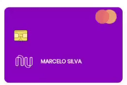

<h1 align="center">Cartão Nubank Flip👋</h1>
<p>
  <a href="https://twitter.com/marcelxsilva" target="_blank">
    
  </a>
</p>

## Install
```sh
  yarn add cartao-nubank-reactjs
```

## Demo


## Props

| Nome  | Obrigatório | Tipo | Valor Padrão | Descrição 
| ------------- | ------------- | ------------- |------------- |------------- |
| reverse | false | boolean | false | alterar lado do cartão |
| name | true | string |  | Nome do Titular |
| cardNumber | true | string | 0000 0000 0000 0000 | Número do Cartão |
| validMonth | true | string | 00 | Validade do Cartão - Mês  |
| validYear | true | string | 00 | Validade do Cartão - Ano  |
| securityCode | true | string | 123 | Código de Segurança  |
| memberSince | true | string | '01/20' | Membro desde  |
| onClick | false | () => {} |  | Método para alterar o lado do Cartão  |


## Author

👤 **Marcelo Silva**

* Website: [marcelxsilva.dev](https://marcelxsilva.dev)
* Twitter: [@marcelxsilva](https://twitter.com/marcelxsilva)

## Show your support

Give a ⭐️ if this project helped you!

***
